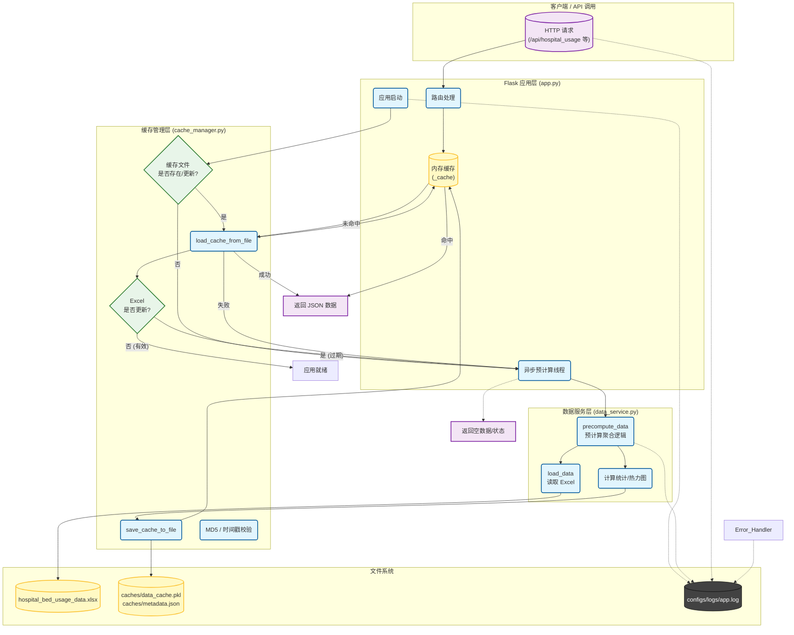

# Bed Usage Analysis System

## 简介
这是一个基于 Flask 和 Pandas 的医院床位使用情况分析系统。系统通过读取 Excel 数据文件，计算各医院和科室的床位使用率、空闲情况等指标，并提供 RESTful API 供前端展示。系统实现了完善的缓存机制，以提高大规模数据处理时的响应速度。

## 系统架构流程图

## 核心逻辑说明

### 1. 缓存策略 (Cache Strategy)
系统采用 **内存 + 文件** 的二级缓存策略：
1.  **一级缓存 (内存)**: `_cache` 字典，最快访问速度。
2.  **二级缓存 (文件)**: `pickle` 序列化文件，用于持久化和跨重启共享。
3.  **缓存失效**: 通过对比 Excel 文件的 **修改时间** 和 **MD5** 值来判断缓存是否过期。

### 2. 数据预计算 (Precomputation)
为了避免每次请求都解析庞大的 Excel 文件，系统在后台进行预计算：
*   **触发时机**: 应用启动时、缓存过期时、或 API 请求未命中缓存时。
*   **计算内容**: 医院/科室床位总数、占用率、热力图数据等。
*   **并发控制**: 使用 `threading` 和 `_cache['precomputing']` 标志位防止重复计算。

### 3. 日志系统 (Logging)
*   使用 `RotatingFileHandler` 实现日志轮转（10MB/文件，保留5个）。
*   同时输出到控制台和 `configs/logs/app.log`。
*   记录关键操作：启动、数据加载、缓存更新、错误堆栈。

## 目录结构
*   `app.py`: Flask 应用入口，路由定义。
*   `data_service.py`: 核心业务逻辑，数据计算与处理。
*   `caches/cache_manager.py`: 缓存文件读写与校验工具。
*   `configs/logger.py`: 日志配置。
*   `precompute_data.py`: 独立的可执行脚本，用于定时任务或手动触发预计算。
